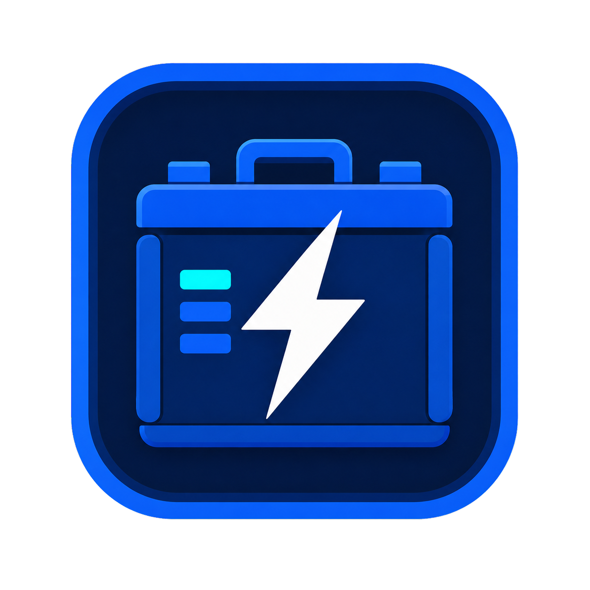
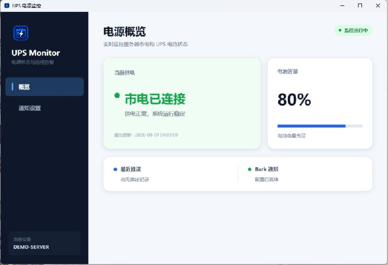
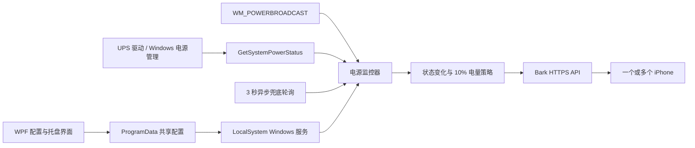

<div align="center">
  
  <h1>UPS Power Monitor</h1>
  <p>面向 Windows Server 的轻量级 UPS 电源监控与 Bark 远程告警工具</p>

  <p>
    
    
    
    
  </p>
</div>

UPS Power Monitor 通过 Windows 原生电源管理接口读取市电、电池容量和充电状态。当市电断开、恢复、电量持续下降或系统即将关机时，它会通过 Bark 把告警推送到一个或多个 iPhone。

应用既可以作为带有现代化界面的托盘程序运行，也可以安装成 LocalSystem Windows 服务，在服务器无人登录时继续监控。

## 功能亮点

| 功能 | 说明 |
| --- | --- |
| 实时电源状态 | 显示市电连接、UPS/电池百分比和充电状态 |
| 双重检测机制 | 响应 Windows 电源事件，并以 3 秒异步轮询兜底 |
| Bark 多设备推送 | 支持多个推送 ID、消息分组、持续响铃和重要警告 |
| 分段电量告警 | 断电期间电池每下降 10 个百分点再次通知 |
| Windows 服务 | LocalSystem 自动启动，无需用户登录即可运行 |
| 系统关机通知 | 正常关机时由服务控制管理器触发关机通知 |
| 系统托盘 | 关闭窗口后继续在后台运行，可从托盘恢复或退出 |
| 低资源占用 | 服务实测空闲工作集约 30 MB，无 WMI 和高频硬件扫描 |

## 界面

界面采用深色侧栏和状态卡片设计：概览页显示供电状态、电池容量与最近推送；设置页用于管理 Bark 参数和 Windows 服务。

<div align="center">
  
</div>

> 项目不包含任何预设 Bark ID。配置只保存在本机 `%ProgramData%\UPSPowerMonitor\settings.json`。

## 工作原理



程序调用 Kernel32 的 `GetSystemPowerStatus`，读取 Windows 已缓存的电源状态。它不会持续枚举 USB 设备，也不依赖 WMI。Windows 发出电源广播时会立即刷新，同时保留轻量级轮询，以兼容不会完整上报事件的 UPS 驱动。

## 通知规则

| 事件 | 推送行为 |
| --- | --- |
| 市电从连接变为断开 | 立即推送断电通知和当前电量 |
| 市电从断开变为连接 | 推送恢复通知、当前电量和断电时长 |
| 断电期间电量下降 | 相对上次告警基准每下降 10 个百分点推送一次 |
| Windows 正常关机 | 在系统服务 `OnShutdown` 阶段尽力发送通知 |
| 强制断电或网络先断开 | 无法保证关机通知送达 |

## 快速开始

### 1. 下载与运行

从 GitHub Releases 下载 `UPSPowerMonitor-win-x64.zip`，解压完整目录后运行：

```text
UPSPowerMonitor.exe
```

发布包是 Windows x64 自包含版本，目标服务器无需预装 .NET。

### 2. 配置 Bark

1. 在 iPhone 的 Bark 中复制推送 ID。
2. 打开“通知设置”，每行填写一个 ID。
3. 根据需要设置消息分组、持续响铃和重要警告。
4. 点击“发送测试”确认配置。

持续响铃会设置 Bark `call=1`；重要警告会使用 `level=critical`，需要在 iOS 和 Bark 中授予相应权限。

### 3. 安装 Windows 服务（推荐）

1. 在“通知设置”中找到“Windows 后台服务”。
2. 点击“安装服务”。
3. 确认 Windows UAC 管理员提示。
4. 状态变为“服务运行中”后，可以关闭或退出托盘程序。

安装后服务会立即运行，并设置为随系统自动启动。服务运行时，WPF 程序不会重复发送自动告警。

> 安装服务后请勿移动发布目录。如需移动，请先卸载服务，移动整个目录后再重新安装。

## 系统要求

- Windows Server 2019 Desktop Experience 或更高版本
- Windows 10 1809 / Windows 11
- x64 处理器
- 能通过 Windows `GetSystemPowerStatus` 报告电量的 UPS 驱动
- 可访问 Bark 服务的网络连接

Windows Server Core 可以运行后台服务，但无法显示 WPF 配置界面，建议先在 Desktop Experience 环境中完成配置。

## 从源码构建

需要 .NET 8 SDK 或 Visual Studio 2022 的“.NET 桌面开发”工作负载。

```powershell
git clone <repository-url>
cd UPSPowerMonitor
dotnet restore .\UPSPowerMonitor.sln --disable-parallel
dotnet build .\UPSPowerMonitor.sln -c Release --no-restore -m:1
```

发布 Windows x64 自包含版本：

```powershell
dotnet publish .\UPSPowerMonitor.csproj `
  -c Release `
  -r win-x64 `
  --self-contained true `
  -p:PublishSingleFile=true `
  -o .\publish\win-x64
```

主项目发布时会自动把 `UPSPowerMonitor.Service.exe` 输出到同一目录。

## 项目结构

```text
UPSPowerMonitor/
├─ UPSPowerMonitor.csproj          # WPF 主程序、托盘和服务管理
├─ UPSPowerMonitor.Core/           # 电源检测、Bark 和共享配置核心
├─ UPSPowerMonitor.Service/        # Windows ServiceBase 宿主
├─ DesktopServices/                # 服务安装、卸载与状态查询
├─ ViewModels/                     # WPF 视图模型
├─ Models/                         # 配置与电源状态模型
├─ Services/                       # 共享业务服务
├─ Assets/                         # 应用图标
└─ .github/workflows/              # Windows CI 构建
```

## 配置与隐私

- Bark ID 仅保存在 `%ProgramData%\UPSPowerMonitor\settings.json`。
- 不包含统计、遥测、广告或后台数据收集。
- 正常监控时不产生网络流量，只有告警或测试时请求 Bark。
- `bin/`、`obj/`、`publish/` 和本机设置不会提交到 Git。

## 常见问题

### 为什么显示“未检测到电池”？

程序依赖 UPS 驱动向 Windows 电源管理层报告电量。请先确认 Windows 自身能够显示 UPS 电池百分比。

### 关闭窗口后程序是不是退出了？

没有。关闭按钮会隐藏到系统托盘。双击托盘图标可恢复，右键选择“退出”才会结束托盘程序。安装 Windows 服务后，即使退出托盘程序，服务仍会继续监控。

### 服务运行时还能修改 Bark 设置吗？

可以。保存后服务会在约 10 秒内自动重新加载设置，无需重启。

### 会不会影响服务器性能？

检测使用异步定时器和轻量级 Kernel32 调用。服务实测空闲工作集约 30 MB，CPU 通常接近 0%。

## 贡献

欢迎提交 Issue 和 Pull Request。开始前请阅读 [CONTRIBUTING.md](CONTRIBUTING.md)。安全问题请参考 [SECURITY.md](SECURITY.md)，不要在公开 Issue 中粘贴 Bark ID 或其他敏感信息。

## 致谢

- [Bark](https://github.com/Finb/Bark) — 简洁可靠的 iOS 推送工具。
- .NET、WPF 和 Windows Service APIs。
